# Mini 프로젝트 - 타이타닉 데이터 분석 

<h2 style="font-size: 25px;"> ✨개발팀원 ✨<br>
</h2>


|||
|:-:|:-:|:-:|
|[@이승언](https://github.com/seungunleeee)|[@손대현](https://github.com/daehyeon)|[@이아영](https://github.com/ayleeee)|
---
<br>

# ⚙ 환경설정

## 1. Connector 설치

MySQL과 ELK 파이프 라인에 연동하기 위한 Connector 설치

```bash
## Version에 맞게 설치 8.0.18로!!!!
$ wget 'https://dev.mysql.com/get/Downloads/Connector-J/mysql-connector-java-8.0.18.tar.gz'
```

## 2. 연동할 mysql과 titanic.csv 파일 적용

```sql
use fisa;
 
DROP TABLE IF EXISTS titanic_raw;

CREATE TABLE titanic_raw
(	passengerid  INT,
	survived     INT,
	pclass       INT,
	name         VARCHAR(100),
	gender       VARCHAR(50),
	age          DOUBLE,
	sibsp        INT,
	parch        INT,
	ticket       VARCHAR(80),
	fare         DOUBLE,
	cabin        VARCHAR(50) ,
	embarked     VARCHAR(20),
	PRIMARY KEY (passengerid)
);
```

```
## 데이터값 설명 ##
설명: 승객 ID (Primary Key)
예시: 1, 2, 3, ...
survived (INT)

설명: 생존 여부를 나타내는 값 (0: 사망, 1: 생존)
예시: 0, 1
pclass (INT)

설명: 객실 등급 (1, 2, 3)
예시: 1(1등급), 2(2등급), 3(3등급)
name (VARCHAR(100))

설명: 승객의 이름
예시: John Doe, Jane Smith
gender (VARCHAR(50))

설명: 성별 (male: 남성, female: 여성)
예시: male, female
age (DOUBLE)

설명: 승객의 나이
예시: 29.0, 35.5, 2.0
sibsp (INT)

설명: 동반한 형제 및 배우자의 수
예시: 0, 1, 2
parch (INT)

설명: 동반한 부모 및 자녀의 수
예시: 0, 1, 3
ticket (VARCHAR(80))

설명: 티켓 번호
예시: A/5 21171, PC 17599
fare (DOUBLE)

설명: 티켓 요금
예시: 72.50, 12.75
cabin (VARCHAR(50))

설명: 객실 번호
예시: C123, E456
embarked (VARCHAR(20))

설명: 탑승 항구 (C: Cherbourg, Q: Queenstown, S: Southampton)
예시: C, Q, S
```

- DBeaver에서 생성한 sql 파일에서 titanic.csv 파일 가져오기

<p align="center"> 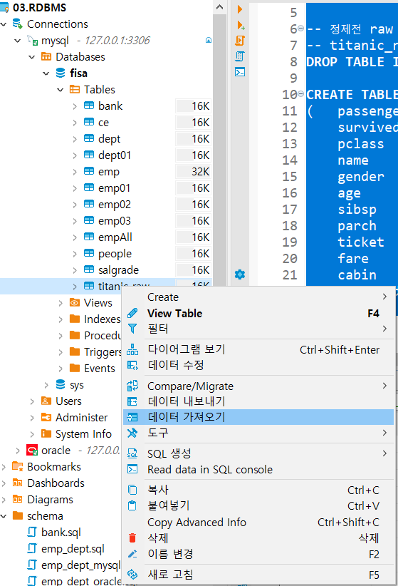</p>

## 3. logstash.conf 파일 수정

```bash
 jdbc {
      jdbc_driver_library => "/home/username/mysql-connector-java-8.0.18/mysql-connector-java-8.0.18.jar"
      jdbc_driver_class => "com.mysql.jdbc.Driver"
      jdbc_connection_string => "jdbc:mysql://localhost:3306/fisa?useUnicode=true&serverTimezone=Asia/Seoul"
      jdbc_user => "root"
      jdbc_password => "root"
      statement => "SELECT * FROM titanic_raw WHERE passengerid > :sql_last_value ORDER BY passengerid ASC"
      record_last_run => true
      clean_run => true
      tracking_column_type => "numeric"
      tracking_column => "passengerid"
      use_column_value => true
      schedule => "*/5 * * * * *" ## 5초마다 갱신
    }
}
filter { ## 필요없는 필드 remove
   mutate {
    rename => {
      "sex" => "gender"
    }
    remove_field => ["@version","@timestamp"]
  }
}
output {
  # 콘솔창에 어떤 데이터들로 필터링 되었는지 확인
  stdout {
    codec => rubydebug
  }
  # 위에서 설치한 Elasticsearch 로 "titanic_new" 라는 이름으로 인덱싱
  elasticsearch {
    hosts => ["http://localhost:9200"]
    index => "titanic_new"
  }
}
```

# 🚢 타이타닉 데이터를 통한 데이터 시각화

## Q1. 전체 생존률 및 성별 생존 비교.

<p align="center">  
&nbsp&nbsp </p>

A : 전체 생존률을 보았을 때  사망한 탑승객이 더 많은것을(사망 > 생존) 확인할 수 있다. 

## Q2. 노블레스 오블리주 실현? 🤷‍♂️

A : 등급별 사망률 확인한 결과 높은 등급일수록 생존자가 많은것을 알 수 있다.

<p align="center">    
&nbsp&nbsp 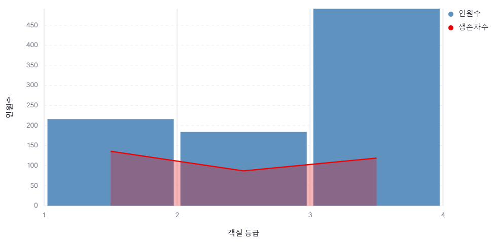</p>

※ 사고로 인해 배의 하단부터 잠기기 시작 → 하단에 위치한 객실 등급의 사람들의 사망률이 높다

**그렇다면 ‘노블레스 오블리주’가 실현되었다는것은 거짓이 아닌가? 라는 의문을 가질 수 있다.**

A : 이를 반증하기 위한 데이터 분석 작업 - 여성 혹은 아이들의 생존률이 높은 것을 확인

<p align="center">  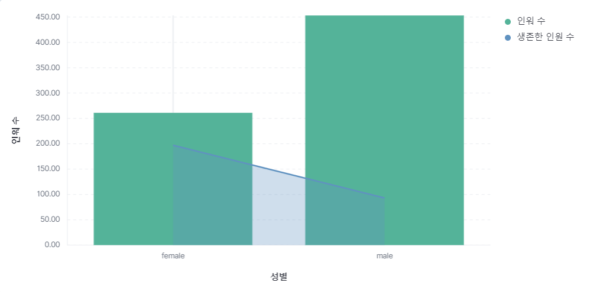  
&nbsp&nbsp 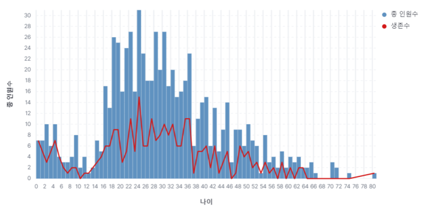</p>


※ Devlop - 연령대별(10대, 20대, 30대…) 생존자 MySQL 사용해서 디벨롭해본 결과

<p align="center"> 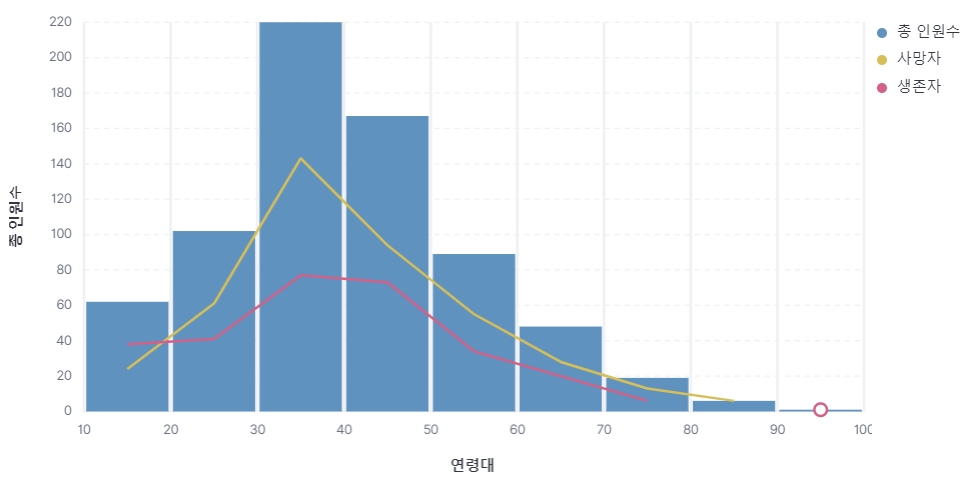</p>
<br>

### SQL 작성 및 .conf 파일 수정 방법 :

1. 연령대 별 타이타닉 탑승 인원 정보  테이블

```sql
create table titanic_age (
age INT,
count INT,
PRIMARY KEY (age)
)
```

1. 연령대 별  생존한 타이타닉 탑승 인원 저장 테이블

```sql
create table titanic_age_survived (
age INT,
survived_count INT,
PRIMARY KEY (age)
)
```

1. 연령대 별 사망한 타이타닉 탑승 인원 저장 테이블

```sql
create table titanic_age_lost(
age INT,
lost_count INT,
PRIMARY KEY (age)
)
```

1. 연령대 별 타이타닉 탑승 인원 정보 insert

```sql
INSERT INTO titanic_age (age, count)
SELECT floor(`Age`/10) * 10 + 10 AS age, COUNT(*) AS count
FROM titanic_raw
WHERE `Age` > 0
GROUP BY floor(`Age`/10) * 10 + 10
ORDER BY age ASC;
```

1. 연령대 별  **생존한** 타이타닉 탑승 인원 insert

```sql
INSERT INTO titanic_age_survived (age, survived_count)
SELECT floor(`Age`/10) * 10 + 10 AS c_age , Count(raw.survived) as survived_count
FROM titanic_raw as raw
WHERE `Age` > 0 and raw.survived = 1
GROUP BY  c_age
ORDER BY c_age ASC;
```

1. 연령대별 **사망한** 타이타닉 탑승 인원 insert

```bash
INSERT INTO titanic_age_lost (age, lost_count)
SELECT floor(`Age`/10) * 10 + 10 AS c_age , Count(raw.survived) as lost_cout
FROM titanic_raw as raw
WHERE `Age` > 0 and raw.survived = 0
GROUP BY  c_age
ORDER BY c_age ASC;
```

1. 여기까지 DB에 필요한 데이터 저장 완료# titanic_total_count.conf 작성

```bash
    # JDBC 플러그인 설정 시작
  jdbc {
    # JDBC 드라이버 라이브러리의 경로를 지정합니다.
    jdbc_driver_library => "/home/ubuntu/mysql-connector-java-8.0.18/mysql-connector-java-8.0.18.jar"
    # JDBC 드라이버 클래스를 지정합니다.
    jdbc_driver_class => "com.mysql.cj.jdbc.Driver"  # com.mysql.jdbc.Driver 대신 com.mysql.cj.jdbc.Driver를 사용하는 것이 좋습니다.
    # MySQL 데이터베이스에 연결할 JDBC URL을 지정합니다.
    jdbc_connection_string => "jdbc:mysql://localhost:3306/fisa?useUnicode=true&serverTimezone=Asia/Seoul"
    # 데이터베이스 사용자명과 비밀번호를 설정합니다.
    jdbc_user => "root"
    jdbc_password => "root"
    # 실행할 SQL 쿼리를 지정합니다. 이전에 읽은 마지막 값보다 큰 passengerid를 가진 레코드를 선택합니다.
    statement => "SELECT * FROM titanic_age ORDER BY age ASC "
    # 마지막 실행 시점을 기록하여 다음 실행 시 이를 참조합니다.
    record_last_run => true
    # 클린 실행을 지정합니다. 이 옵션이 true이면, 최초 실행 시 모든 데이터를 가져옵니다.
    clean_run => true
    # 추적할 컬럼의 타입을 지정합니다. numeric 타입으로 설정합니다.
    tracking_column_type => "numeric"
    # 추적할 컬럼을 지정합니다. 이 컬럼의 값을 기준으로 데이터를 추적합니다.
    tracking_column => "age"
    # 데이터의 컬럼 값을 사용할지 여부를 설정합니다.
    use_column_value => true
    # 데이터베이스 쿼리 실행 주기를 설정합니다. 여기서는 5초마다 실행되도록 설정했습니다.
  }
}
filter {
}
output {
  # 콘솔 창에 필터링된 데이터를 출력하여 확인할 수 있도록 설정합니다.
  stdout {
    codec => rubydebug
  }
  # Elasticsearch에 데이터를 출력하여 인덱스 "titanic"로 저장합니다.
  elasticsearch {
    # Elasticsearch 서버의 호스트 주소를 설정합니다.
    hosts => ["http://localhost:9200"]
    # Elasticsearch에 저장될 인덱스의 이름을 설정합니다.
    index => "titanic_age"
  }
}
```

1. titanic_survived.conf 작성

```bash
	
   # JDBC 플러그인 설정 시작
  jdbc {
    # JDBC 드라이버 라이브러리의 경로를 지정합니다.
    jdbc_driver_library => "/home/ubuntu/mysql-connector-java-8.0.18/mysql-connector-java-8.0.18.jar"
    # JDBC 드라이버 클래스를 지정합니다.
    jdbc_driver_class => "com.mysql.cj.jdbc.Driver"  # com.mysql.jdbc.Driver 대신 com.mysql.cj.jdbc.Driver를 사용하는 것이 좋습니다.
    # MySQL 데이터베이스에 연결할 JDBC URL을 지정합니다.
    jdbc_connection_string => "jdbc:mysql://localhost:3306/fisa?useUnicode=true&serverTimezone=Asia/Seoul"
    # 데이터베이스 사용자명과 비밀번호를 설정합니다.
    jdbc_user => "root"
    jdbc_password => "root"
    # 실행할 SQL 쿼리를 지정합니다. 이전에 읽은 마지막 값보다 큰 passengerid를 가진 레코드를 선택합니다.
    statement => "SELECT * FROM titanic_age_survived  ORDER BY age ASC "
    # 마지막 실행 시점을 기록하여 다음 실행 시 이를 참조합니다.
    record_last_run => true
    # 클린 실행을 지정합니다. 이 옵션이 true이면, 최초 실행 시 모든 데이터를 가져옵니다.
    clean_run => true
    # 추적할 컬럼의 타입을 지정합니다. numeric 타입으로 설정합니다.
    tracking_column_type => "numeric"
    # 추적할 컬럼을 지정합니다. 이 컬럼의 값을 기준으로 데이터를 추적합니다.
    tracking_column => "age"
    # 데이터의 컬럼 값을 사용할지 여부를 설정합니다.
    use_column_value => true
  }
}
filter {
}
output {
  # 콘솔 창에 필터링된 데이터를 출력하여 확인할 수 있도록 설정합니다.
  stdout {
    codec => rubydebug
  }
  # Elasticsearch에 데이터를 출력하여 인덱스 "titanic"로 저장합니다.
  elasticsearch {
    # Elasticsearch 서버의 호스트 주소를 설정합니다.
    hosts => ["http://localhost:9200"]
    # Elasticsearch에 저장될 인덱스의 이름을 설정합니다.
    index => "titanic_servived"
  }
}
```

1. titanic_lost.conf 작성

```bash
  # JDBC 플러그인 설정 시작
  jdbc {
    # JDBC 드라이버 라이브러리의 경로를 지정합니다.
    jdbc_driver_library => "/home/ubuntu/mysql-connector-java-8.0.18/mysql-connector-java-8.0.18.jar"
    # JDBC 드라이버 클래스를 지정합니다.
    jdbc_driver_class => "com.mysql.cj.jdbc.Driver"  # com.mysql.jdbc.Driver 대신 com.mysql.cj.jdbc.Driver를 사용하는 것이 좋습니다.
    # MySQL 데이터베이스에 연결할 JDBC URL을 지정합니다.
    jdbc_connection_string => "jdbc:mysql://localhost:3306/fisa?useUnicode=true&serverTimezone=Asia/Seoul"
    # 데이터베이스 사용자명과 비밀번호를 설정합니다.
    jdbc_user => "root"
    jdbc_password => "root"
    # 실행할 SQL 쿼리를 지정합니다. 이전에 읽은 마지막 값보다 큰 passengerid를 가진 레코드를 선택합니다.
    statement => "SELECT * FROM titanic_age_lost ORDER BY age ASC "
    # 마지막 실행 시점을 기록하여 다음 실행 시 이를 참조합니다.
    record_last_run => true
    # 클린 실행을 지정합니다. 이 옵션이 true이면, 최초 실행 시 모든 데이터를 가져옵니다.
    clean_run => true
    # 추적할 컬럼의 타입을 지정합니다. numeric 타입으로 설정합니다.
    tracking_column_type => "numeric"
    # 추적할 컬럼을 지정합니다. 이 컬럼의 값을 기준으로 데이터를 추적합니다.
    tracking_column => "age"
    # 데이터의 컬럼 값을 사용할지 여부를 설정합니다.
    use_column_value => true

  }
}
filter {
}
output {
  # 콘솔 창에 필터링된 데이터를 출력하여 확인할 수 있도록 설정합니다.
  stdout {
    codec => rubydebug
  }
  # Elasticsearch에 데이터를 출력하여 인덱스 "titanic"로 저장합니다.
  elasticsearch {
    # Elasticsearch 서버의 호스트 주소를 설정합니다.
    hosts => ["http://localhost:9200"]
    # Elasticsearch에 저장될 인덱스의 이름을 설정합니다.
    index => "titanic_lost"
  }
}
```

1. logstash 명령어 실행

```bash
# 연령 별 타이타닉 탑승 인원 index 생성
sudo /usr/share/logstash/bin/logstash -f /{파일경로}/titanic_total_count.conf

#연령 별 타이타닉 탑승 중 생존 인원 index 생성
sudo /usr/share/logstash/bin/logstash -f /{파일경로}/titanic_survived.conf

#연령 별 타이타닉 탑승 중 사망 인원 index 생성
sudo /usr/share/logstash/bin/logstash -f /{파일경로}/titanic_lost.conf
```

✓ 노블레스 오블리주를 실천한 인원 검색

<p align="center"> </p>
<br>

- sql 문장

```sql
SELECT passengerid ,survived, pclass, name, embarked
FROM titanic_raw
WHERE name LIKE '%Guggenheim%' or name LIKE '%Straus%' or name LIKE '%Bird%'

## 결과 ##
passengerid|survived|pclass|name                                  |embarked|
-----------+--------+------+--------------------------------------+--------+
        790|       0|     1|Guggenheim, Mr. Benjamin              |C       |
        973|       0|     1|Straus, Mr. Isidor                    |S       |
       1006|       1|     1|Straus, Mrs. Isidor (Rosalie Ida Blun)|S       |
       1048|       1|     1|Bird, Miss. Ellen                     |S       |
```

## ***<노블레스 오블리주가 잘 실천 되었구나!!>***

## Q3. 각 **국에서 탑승한 사람들은 어느 객실에 머물렀을까?**

A : 영국(S)에서 탑승한 승객들의 수가 가장 많고, 많이 사망하였다.

<p align="center"> </p>

A : 각 국에서 탑승한 인원들의 최애 객실 (Mysql로 작성)

<p align="center">  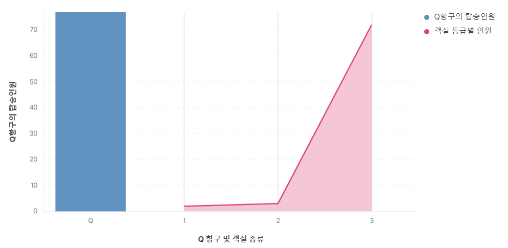 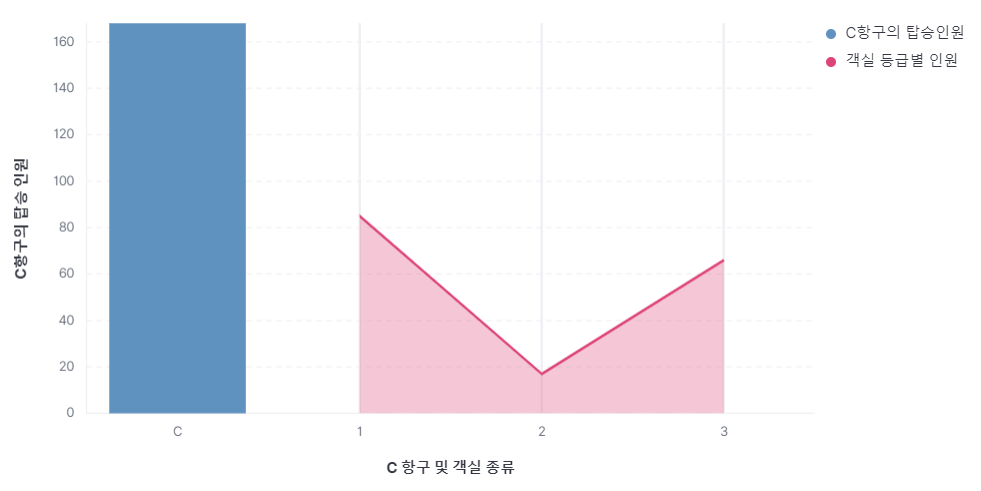</p>

<p align="center"> 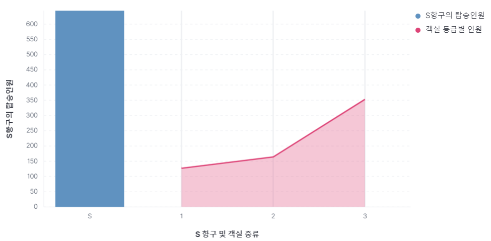</p>

<p align="center">↓↓↓↓↓↓</p>

<p align="center"> 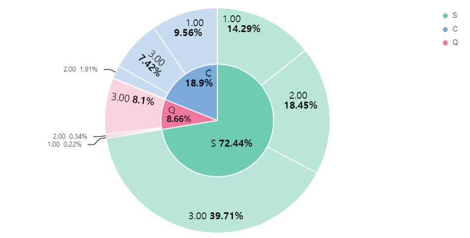</p>
<br>

- 결과를 담을 table 생성

```sql
# 항구 별 탑승인원 관련 table 생성
create table embark_count (
	embarked     VARCHAR(20),
	passenger INT,
	PRIMARY KEY (embarked)
)

# S 항구 탑승 인원의 객실 등급별 count 관련 table
create table embark_s_count (
	pclass       INT,
	passenger    INT,
	embarked     VARCHAR(20),
	PRIMARY KEY (pclass)
)

# C 항구 탑승 인원의 객실 등급별 count 관련 table
create table embark_c_count (
	pclass       INT,
	passenger    INT,
	embarked     VARCHAR(20),
	PRIMARY KEY (pclass)
)

# Q 항구 탑승 인원의 객실 등급별 count 관련 table
create table embark_q_count (
	pclass       INT,
	passenger    INT,
	embarked     VARCHAR(20),
	PRIMARY KEY (pclass)
)
```

- 총 항구 (embark)별 탑승 인원  insert

```sql
INSERT INTO embark_count (embarked, passenger)
select embarked, count(*) as passenger from
titanic_raw
WHERE TRIM(embarked) != '' and embarked is NOT NULL
group by  embarked;
```

- Q 항구 탑승 인원 중 객실 등급별  탑승 인원 수 insert

```sql
INSERT INTO embark_q_count (pclass, passenger , embarked)
select pclass , count(*) as passenger , embarked from
titanic_raw where embarked  = 'Q'
group by embarked , pclass
order by pclass;
```

- S 항구 탑승 인원 중 객실 등급별 탑승 인원 수 insert

```sql
## S 탑승 인원
INSERT INTO embark_s_count (pclass, passenger , embarked)
select pclass , count(*) as passenger , embarked from
titanic_raw where embarked  = 'S'
group by pclass
order by pclass;
```

- C 항구 탑승 인원 중 객실 등급별로 탑승 인원 수  insert

```sql
 ## C 탑승 인원
INSERT INTO embark_c_count (pclass, passenger , embarked)
select pclass , count(*) as passenger , embarked from
titanic_raw where embarked  = 'C'
group by pclass
order by pclass;
```

- 여기까지 sql을 통해 필요한 테이블 , 및 insert 문 실행 끝## embark-total.conf 작성 
(항구 별 탑승 인원 관련 .conf 파일)

```bash
input() {
    jdbc_driver_class => "com.mysql.cj.jdbc.Driver"  # com.mysql.jdbc.Driver 대신 com.mysql.cj.jdbc.Driver를 사용하는 것이 좋습니다.
    jdbc_connection_string => "jdbc:mysql://localhost:3306/fisa?useUnicode=true&serverTimezone=Asia/Seoul"
    jdbc_user => "root"
    jdbc_password => "root"
    statement => "select * from embark_count order by embarked;"
    record_last_run => true
    clean_run => true
    tracking_column_type => "numeric"
    tracking_column => "embarked"
    use_column_value => true
  }
}
filter {
}
output {

  stdout {
    codec => rubydebug
  }

  elasticsearch {

    hosts => ["http://localhost:9200"]
    index => "embarked-total"
  }
}

```

- S 항구   (S 항구 탑승 인원 중 객실 등급별 탑승 인원 수 관련 .conf 파일)

```bash

    jdbc_driver_class => "com.mysql.cj.jdbc.Driver"  # com.mysql.jdbc.Driver 대신 com.mysql.cj.jdbc.Driver를 사용하는 것이 좋습니다.
    jdbc_connection_string => "jdbc:mysql://localhost:3306/fisa?useUnicode=true&serverTimezone=Asia/Seoul"
    jdbc_user => "root"
    jdbc_password => "root"
    # (BOLD) embark_s_count 외의 다른 항구에 대해서 index 생성시 변경 해 주셔야합니다.
    #  -- c 항구별 객실 등급별 탑승인원을 조회하고 싶은 경우 ex)  "select * from embark_c_count order by pclass;"
    statement => "select * from embark_s_count order by pclass;"
    record_last_run => true
    clean_run => true
    tracking_column_type => "numeric"
    tracking_column => "pclass"
    use_column_value => true
  }
}
filter {
}
output {

  stdout {
    codec => rubydebug
  }
  elasticsearch {
    hosts => ["http://localhost:9200"]
# 항상 새로운 인덱스를 생성할 때마다 고유하도록 이름을 정해주셔야합니다.
    index => "titanic_embarked_s"
  }
}
```

- .conf 파일 작성 끝## Logstash를 .conf 파일을 지정하여 실행

```bash
sudo /usr/share/logstash/bin/logstash -f /{embark-total.conf 경로}/embark-total.conf

# 항구별 .conf 파일 지정 ex) c항구일 경우 sudo /usr/share/logstash/bin/logstash -f /{embark_c_count 경로}/embark_c_count
sudo /usr/share/logstash/bin/logstash -f /{embark_*_count 경로}/embark_*_count
```

# 🔫 트러블 슈팅

- Connector를 설치할때 8.0.33 버전으로 conf 파일에 적용하였을 경우 데이터가 계속해서 중첩되는 상황이 발생 → 8.0.18 버전의 Connector를 통해 문제 해결
- 탑승항구 별 인원수를 확인할 때 그림과 같이 empty 값이 같이 추가됨 → filter 추가하여 해결


<p align="center">  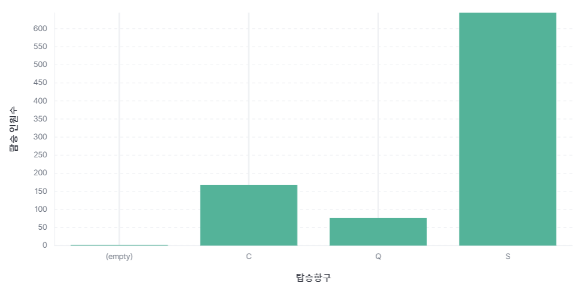
&nbsp&nbsp 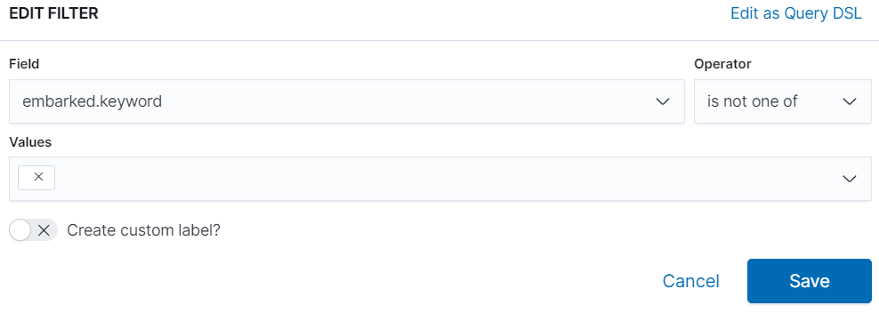</p>
<br>

## 🤝 TODO

<p><s> - github 작업 -> 완료!</s></p>
